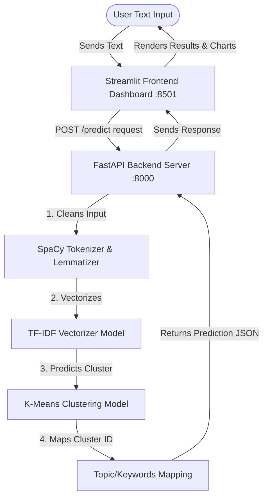

# 🧩 Semantic Document Clustering Hub

An end-to-end unsupervised NLP application that performs real-time semantic document clustering using **TF-IDF Vectorization** and **K-Means Clustering**. The project features a dual-service architecture with a **FastAPI** backend API and a premium **Streamlit** frontend dashboard. It is fully containerized using **Docker** and pre-configured for direct deployment as a **Hugging Face Space**.

[](https://huggingface.co/spaces/ahmedsharaf/document_clustering)  
🌐 **Live Demo**: [Try the live application here](https://huggingface.co/spaces/ahmedsharaf/document_clustering)

---

## 📋 Table of Contents
- [Project Overview](#-project-overview)
- [Key Features](#-key-features)
- [System Architecture](#-system-architecture)
- [Directory Structure](#-directory-structure)
- [How to Run the Application](#-how-to-run-the-application)
  - [Option 1: Run with Docker (Recommended)](#option-1-run-with-docker-recommended)
  - [Option 2: Run Locally (Python Virtual Environment)](#option-2-run-locally-python-virtual-environment)
- [How to Run the Training Notebooks & Setup Data](#-how-to-run-the-training-notebooks--setup-data)
- [API Documentation](#-api-documentation)
- [Hugging Face Spaces Live Demo Deployment](#-hugging-face-spaces-live-demo-deployment)

---

## 🔍 Project Overview

This project aims to group unstructured text documents into meaningful categories without prior annotations. We train and evaluate K-Means models on two distinct text corpora:

1. **Wikipedia Biography Dataset**: Clusters biographies into 7 distinct professional fields:
   * 🎸 *Music, Bands & Singers*
   * ⚽ *Team Sports (Football, Baseball, etc.)*
   * 🎓 *Academia, Science & Research*
   * 📚 *Literature, Writing & Publishing*
   * 🎬 *Film, TV & Acting*
   * ⚖️ *Politics, Law & Government*
   * 🏃 *Athletics, Racing & Olympics*
2. **20 Newsgroups Dataset**: Clusters raw internet news discussions into 3 distinct themes:
   * 🏒 *Hockey & Team Sports*
   * 🌍 *Middle East Politics & Religion*
   * 💾 *PC Hardware & Storage (SCSI/Disk)*

---

## ⚡ Key Features

* **SpaCy Preprocessing**: Cleans input text by performing lowercasing, removing URLs, punctuation, digits, and filtering out stopwords before extracting word lemmas.
* **TF-IDF Feature Extraction**: Converts cleaned texts into high-dimensional numerical vectors using optimized vectorizers.
* **K-Means Prediction**: Uses pre-trained K-Means models to predict the nearest cluster for incoming documents.
* **FastAPI Backend**: A lightweight, high-performance, asynchronous REST API serving live cluster predictions.
* **Streamlit Frontend**: A sleek, reactive dashboard that visualizes predicted themes, token cleaning details, and cluster-keyword associations via ranked relevance bar charts.

---

## 🏗️ System Architecture



---

## 📂 Directory Structure

```
├── app/
│   ├── api.py               # FastAPI backend endpoints and model serving
│   ├── ui.py                # Streamlit UI dashboard and data visualization
│   └── start.sh             # Combined shell startup script for both services
├── models/                  # Pre-trained vectorizers and K-Means models (.pkl)
│   ├── kmeans_news_model.pkl
│   ├── kmeans_wiki_model.pkl
│   ├── tfidf_news_vectorizer.pkl
│   └── tfidf_wiki_vectorizer.pkl
├── utils/                   # Shared utility modules
│   ├── __init__.py
│   ├── data_preprocessing.py # Text cleansing & SpaCy lemmatization pipeline
│   └── feature_extraction.py # TF-IDF fitting, tuning, and transforming
├── Dockerfile               # Multi-port container build script
├── requirements.txt         # Project dependencies
├── news_notebook.ipynb      # Training & exploration notebook for 20 Newsgroups
├── wiki_notebook.ipynb      # Training & exploration notebook for Wikipedia biographies
└── README.md                # Documentation and Hugging Face configuration
```

---

## 🚀 How to Run the Application

The application is structured to run both the FastAPI backend (`http://localhost:8000`) and the Streamlit frontend (`http://localhost:8501`) concurrently.

### Option 1: Run with Docker (Recommended)

1. **Build the Docker Image**:
   ```bash
   docker build -t document-clustering .
   ```

2. **Run the Container**:
   Map port `8000` (FastAPI) and port `8501` (Streamlit frontend) while setting the startup port environment variable to `8501`:
   ```bash
   docker run -p 8000:8000 -p 8501:8501 -e PORT=8501 document-clustering
   ```

3. **Access the Services**:
   * **Streamlit UI**: Open [http://localhost:8501](http://localhost:8501) in your browser.
   * **FastAPI Docs**: Visit [http://localhost:8000/docs](http://localhost:8000/docs) to explore/test the endpoints.

---

### Option 2: Run Locally (Python Virtual Environment)

1. **Set Up a Virtual Environment**:
   ```bash
   python -m venv venv
   source venv/bin/activate  # On Windows, use `venv\Scripts\activate`
   ```

2. **Install Dependencies**:
   ```bash
   pip install -r requirements.txt
   ```

3. **Download the SpaCy English Model**:
   ```bash
   python -m spacy download en_core_web_sm
   ```

4. **Launch the Backend API**:
   ```bash
   uvicorn app.api:app --host 0.0.0.0 --port 8000
   ```

5. **Launch the Streamlit UI** (in a separate terminal window):
   ```bash
   streamlit run app/ui.py --server.port 8501
   ```

---

## 📓 How to Run the Training Notebooks & Setup Data

If you wish to explore the training pipelines or retrain the K-Means models using the Jupyter notebooks:

### 1. Download the Dataset
The Wikipedia biography clustering notebook relies on external data from Kaggle.
* **Dataset Link**: [Kaggle - People Wikipedia Data](https://www.kaggle.com/datasets/sameersmahajan/people-wikipedia-data)

### 2. Create the Data Folder
In the root directory of this project, create a new directory named `data` and place the downloaded file inside:
```bash
# Create the data folder in the project root
mkdir data
```

### 3. Place the File
Extract/move the downloaded CSV file so that its path matches:
`data/people_wiki.csv`

> [!NOTE]
> The **20 Newsgroups** notebook (`news_notebook.ipynb`) does not require manual data setup. It uses the `sklearn.datasets.fetch_20newsgroups` utility to fetch and download the corpus programmatically on its first execution.

---

## 🔌 API Documentation

FastAPI exposes interactive API documentations at `/docs` (Swagger UI) or `/redoc` (Redoc UI).

### Endpoints Summary

#### 1. System Health Check
* **Method**: `GET`
* **Path**: `/`
* **Response Example**:
  ```json
  {
    "status": "online",
    "models_loaded": {
      "wiki": true,
      "news": true
    },
    "wiki_clusters_count": 7,
    "news_clusters_count": 3
  }
  ```

#### 2. Predict Document Cluster
* **Method**: `POST`
* **Path**: `/predict`
* **Request Body**:
  ```json
  {
    "text": "Marie Curie was a physicist and chemist who conducted pioneering research on radioactivity.",
    "model_type": "wiki"
  }
  ```
* **Response Body**:
  ```json
  {
    "success": true,
    "model_type": "wiki",
    "original_text": "Marie Curie was a physicist and chemist who conducted pioneering research on radioactivity.",
    "preprocessed_text": "marie curie physicist chemist conduct pioneering research radioactivity",
    "cluster_id": 2,
    "topic": "Academia, Science & Research",
    "keywords": ["university", "research", "professor", "science", "study", "institute", "book", "phd", "work", "award"]
  }
  ```

---

## ☁️ Hugging Face Spaces Live Demo

The project is deployed and running as a live demo on Hugging Face Spaces. You can access it directly via:

👉 **[Hugging Face Space: Document Clustering](https://huggingface.co/spaces/ahmedsharaf/document_clustering)**

### Infrastructure Details

This Hugging Face Space is powered by the Docker SDK. The metadata block (YAML frontmatter) at the top of this `README.md` configures the Hugging Face deployment pipeline. When changes are pushed, the space automatically builds the container using the workspace `Dockerfile` and exposes the Streamlit application on port `8501`.
